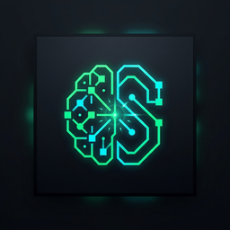

<div align="center">



# ⚡ Synapse MCQ Studio

**Ultra-Low-RAM, Native Cross-Platform Desktop Platform for AI-Powered PDF MCQ Testing & Learning**

[](https://github.com/manuja-me/synapse-mcq-desktop/releases/tag/v0.1.6)
[](https://tauri.app/)
[](https://react.dev/)
[](#-ultra-low-ram-engineering)
[](https://github.com/manuja-me/synapse-mcq-desktop/releases/tag/v0.1.6)
[](LICENSE)

</div>

---

## 📖 Overview

**Synapse MCQ Studio** is a high-performance desktop application engineered with **Rust, Tauri v2, React 19, and Bun**. It bridges AI prompt synthesis and desktop study testing:
1. **AI Prompt Studio**: Interactively configure academic parameters and generate standardized JSON-enforcing prompts for Antigravity with your PDF course materials.
2. **Ingestion Shield**: Validate, parse, and store multi-topic MCQ decks with zero cloud telemetry (100% offline & local).
3. **Obsidian-Spatial Testing HUD**: Practice or take timed exams inside a distraction-free, pointed-geometry dark interface with live visual gamification rewards, didactic distractor analysis, and sub-45 MB RAM usage.

---

## 📥 Cross-Platform Binary Downloads

Download the latest pre-compiled binaries from [**GitHub Releases (v0.1.6)**](https://github.com/manuja-me/synapse-mcq-desktop/releases/tag/v0.1.6):

| Operating System | Package Type | Download / Installation |
| :--- | :--- | :--- |
| **Windows 10 / 11** | Portable Standalone `.zip` | [**`Synapse-MCQ-Studio-v0.1.6-windows-x64.zip`**](https://github.com/manuja-me/synapse-mcq-desktop/releases/download/v0.1.6/Synapse-MCQ-Studio-v0.1.6-windows-x64.zip) *(Extract & Run `Synapse-MCQ-Studio.exe`)* |
| **Windows 10 / 11** | NSIS Installer `.exe` | [**`Synapse.MCQ.Studio_0.1.6_x64-setup.exe`**](https://github.com/manuja-me/synapse-mcq-desktop/releases/download/v0.1.6/Synapse.MCQ.Studio_0.1.6_x64-setup.exe) |
| **Windows 10 / 11** | MSI Enterprise `.msi` | [**`Synapse.MCQ.Studio_0.1.6_x64_en-US.msi`**](https://github.com/manuja-me/synapse-mcq-desktop/releases/download/v0.1.6/Synapse.MCQ.Studio_0.1.6_x64_en-US.msi) |
| **macOS** (Apple Silicon) | Native `.dmg` Installer | [**`Synapse.MCQ.Studio_0.1.6_aarch64.dmg`**](https://github.com/manuja-me/synapse-mcq-desktop/releases/download/v0.1.6/Synapse.MCQ.Studio_0.1.6_aarch64.dmg) |
| **Arch Linux** | Native `.pkg.tar.zst` | `sudo pacman -U synapse-mcq-desktop-0.1.6-1-x86_64.pkg.tar.zst` |
| **Ubuntu / Debian** | `.deb` Package | `sudo dpkg -i Synapse.MCQ.Studio_0.1.6_amd64.deb` |
| **Linux Universal** | Standalone `.AppImage` | `chmod +x Synapse.MCQ.Studio_0.1.6_amd64.AppImage && ./Synapse.MCQ.Studio_0.1.6_amd64.AppImage` |
| **Verification** | SHA256 Checksums | [**`SHA256SUMS.txt`**](https://github.com/manuja-me/synapse-mcq-desktop/releases/download/v0.1.6/SHA256SUMS.txt) |

---

## 🚀 Key Features

### 1. 🗂️ Native Desktop Sidebar Navigation
- **Persistent Left Workspace Sidebar**: Standard desktop ergonomic layout replacing awkward top tab bars.
- **Vertical Navigation Tabs**:
  - **Prompt Studio** (`Sparkles`): Configure prompt parameters and generate copy-ready Antigravity prompts.
  - **Question Bank** (`BookOpen` + live count badge): Search, filter, launch, and manage question decks.
  - **Ingest JSON** (`FileJson`): Drag-and-drop or paste raw JSON schema definitions.
- **Active Test Status Card**: Live test indicator with mode badge (`Practice` / `Exam`) and instant "Exit Test" button with safe memory reclamation.
- **Sidebar Footer Controls**: Centralized Settings button (`Ctrl+,`), Win32 Working-Set RAM Flush button, and offline local status indicator.

### 2. ⚙️ Centralized Settings & Preferences (`Ctrl+,`)
- Accessible via Sidebar, Command Palette (`Ctrl+K`), or global shortcut (`Ctrl+,` / `Cmd+,`).
- **General & Quiz Defaults**: Select default mode (Practice with instant explanations vs. Timed Exam mode), configure exam timers (30s–120s per question), and toggle auto-advance on answer.
- **Visual Gamification Controls**: Independent toggles for floating reward chips, streak multipliers, and quick strike speed bonuses. (Audio synthesis is 100% removed for distraction-free silence).
- **RAM & Performance Engine**: Auto-flush unused heap pages on navigation and manual Win32 working-set compact trigger.
- **Data Management**: One-click JSON backup export, starter deck restoration, and protected clear data action with native confirmation modals.

### 3. 🏆 Gamification & Reward Engine
- **Dynamic Streak Multiplier**:
  - **Base Score**: `+100 PTS` per correct answer.
  - **3x Streak**: `1.25x Multiplier` (`+125 PTS`, Amber `⚡ COMBO 3X` badge).
  - **5x Streak**: `1.5x Multiplier` (`+150 PTS`, Orange `🔥 ON FIRE 5X` badge).
  - **10x+ Streak**: `2.0x Multiplier` (`+200 PTS`, Cyan `👑 HYPER-ACCURACY 10X` badge).
- **Quick Strike Speed Bonus**: Answering within 15 seconds awards an extra `+25 PTS` speed bonus.
- **Floating Reward Banner**: Micro-animated emerald chips pop on correct answers displaying points earned and milestone badges.
- **Cognitive Diagnostic Dashboard**: Results screen provides mastery ratings, topic-by-topic breakdowns, and missed question review.

### 4. ⚡ Fluid, Hardware-Accelerated 140ms Transitions
- **Direction-Aware Horizontal Slide**: Questions slide horizontally in 140ms using hardware-accelerated GPU transforms (`translate3d(±18px, 0, 0)` &rarr; `0`).
- **Tactile Button Physics**: Micro-press feedback (`active:scale-[0.988]`) and instant emerald border focus.
- **Zero Audio Overhead**: 100% silent execution with no audio decoding buffers or unwanted chime distractions.

### 5. 🎛️ AI Prompt Studio (Unified Prompt Generator)
- **Interactive Configuration**:
  - **Question Count**: 5, 10, 15, 20, 30, 50 questions (or custom).
  - **Difficulty Distribution**: Balanced, Easy, Medium, Hard, Progressive Adaptive.
  - **Question Archetype**: Conceptual & Theory, Practical / Application, Case Study & Scenario, High-Yield Board Exam, Edge Cases & Trick Questions.
  - **Target Level**: High School, Undergraduate, Graduate / Postgrad, Professional Certification.
  - **Explanation Depth**: Didactic (every option analyzed), Concise Rationale, Key Takeaway Only.
- **One-Click Copy**: Synthesizes and copies an optimized prompt directly to clipboard to paste into Antigravity alongside your PDF.

### 6. 🛡️ Ingestion Shield & Question Bank
- **Drag-and-Drop & Raw JSON Editor**: Ingest `.json` or `.csv` files or paste directly from clipboard.
- **Real-Time Schema Validation**: Fast Rust-powered validation (`parse_and_validate_deck`) verifying question stems, 4-choice bounds, and answer keys.
- **Local Storage Shield**: All decks and attempt histories are persisted locally in `localStorage` — 0% cloud tracking.

### 7. 🧠 Pointed Industrial Aesthetic & Native Frameless Titlebar
- **Strict Geometric Corners**: 0px pointed corners (`rounded-none`, `border-radius: 0 !important`), hair-thin borders (`#27272A`), and dark void palette (`#09090B`, `#121215`, `#10B981`).
- **Reliable Window Controls**: Dedicated Minimize (`_`), Maximize (`□`), and Close (`✕`) buttons with OS-level IPC handlers that work reliably without dragging interference.
- **KaTeX LaTeX Math Rendering**: Renders mathematical equations ($O(N \log N)$, $\sum_{i=1}^n$, formulas) cleanly.
- **Desktop-Native Modals**: Annoying browser popups (`tauri.localhost says`) are eliminated and replaced with desktop-native modal dialogs.

---

## 🔄 Upgrading Versions Without Losing Data

Synapse MCQ Studio is engineered with **zero-data-loss architecture across updates**:

1. **Persistent OS AppData Directory**:
   All question decks (`decks.json`), automatic rolling backups (`backups/`), and user preferences (`settings.json`) are stored permanently in the operating system's standard Application Data folder:
   - **Windows**: `%APPDATA%\com.synapse.mcq\` (e.g. `C:\Users\<user>\AppData\Roaming\com.synapse.mcq\`)
   - **macOS**: `~/Library/Application Support/com.synapse.mcq/`
   - **Linux**: `~/.local/share/com.synapse.mcq/`

2. **How to Upgrade Seamlessly**:
   - **Windows Portable**: Download the new `Synapse-MCQ-Studio-vX.Y.Z-windows-x64.zip` and extract it anywhere. When you launch `Synapse-MCQ-Studio.exe`, it automatically loads all your existing decks and exam histories from the OS directory.
   - **Windows Installer (Setup / MSI)**: Run the new installer; it updates the binaries in `Program Files` while preserving your AppData storage.
   - **macOS (`.dmg`)**: Drag the new `Synapse MCQ Studio.app` into Applications; macOS keeps your Application Support files intact.
   - **Linux (`.pkg.tar.zst` / `.deb` / `.AppImage`)**: Upgrade via `pacman -U`, `dpkg -i`, or run the new `.AppImage`; user data in `~/.local/share/` is untouched.

3. **Automatic Rolling Backups**:
   - Before saving changes to `decks.json`, the app archives timestamped snapshots to `backups/decks-backup-<timestamp>.json` (retaining the 10 most recent backups).

4. **Explorer Access & In-App Restores**:
   - Press **<kbd>Ctrl+,</kbd>** (Settings) &rarr; **Storage & Data**:
     - Click **Open Folder** to access or copy your raw `.json` files directly in File Explorer / Finder.
     - Click **Export** to create a standalone backup file.
     - Click **Restore JSON** to restore question sets from any saved backup.

---

## ⚡ Ultra-Low-RAM Engineering

Synapse MCQ Studio is specifically designed to operate within a **strict sub-45 MB RAM ceiling**:

| Mechanism | Implementation | Impact |
| :--- | :--- | :--- |
| **Rust Native Core** | Compiled Rust backend (`app_lib`) with zero heavy runtimes | Memory footprint of core process is ~3–5 MB |
| **Native OS WebViews** | Uses Edge WebView2 on Windows, WebKit on macOS, and WebKitGTK on Linux | Eliminates bundled Chromium (~150 MB savings) |
| **Win32 Working-Set Flush** | Calls `SetProcessWorkingSetSize` / `EmptyWorkingSet` via Windows API | Flushes inactive heap pages back to the OS memory manager |
| **Zero Audio Overhead** | Completely removed sound engine assets and Web Audio buffers | 0 MB sound memory footprint |
| **GPU Layer Acceleration** | CSS transforms and opacity animations rendered on GPU layers | Fluid 60+ FPS without CPU heap spikes |

---

## ⌨️ Keyboard Shortcuts Reference

| Shortcut | Action |
| :--- | :--- |
| `Ctrl + K` / `Cmd + K` | Open Universal Command Palette |
| `Ctrl + ,` / `Cmd + ,` | Open Centralized Settings & Preferences |
| `1`, `2`, `3`, `4` or `A`, `B`, `C`, `D` | Select Option A, B, C, or D |
| `Space` or `Enter` | Submit Answer / Advance to Next Question |
| `Right Arrow` or `J` | Navigate Forward to Next Question |
| `Left Arrow` or `K` | Navigate Backward to Previous Question |
| `F` | Toggle Review Flag on Current Question |
| `Esc` | Close Modals / Command Palette |

---

## 🏃 Building Locally from Source

### Prerequisites
- [Rust](https://www.rust-lang.org/tools/install) (1.77.2+)
- [Bun](https://bun.sh/) (or Node.js 20+)
- Platform dependencies:
  - **Windows**: Microsoft Visual Studio C++ Build Tools or MinGW
  - **Linux**: `libwebkit2gtk-4.1-dev libappindicator3-dev librsvg2-dev patchelf`
  - **macOS**: Xcode Command Line Tools

### Steps

```bash
# 1. Clone the repository
git clone https://github.com/manuja-me/synapse-mcq-desktop.git
cd synapse-mcq-desktop

# 2. Install frontend dependencies
bun install

# 3. Run in Development Mode
bun run tauri dev

# 4. Compile Frontend and Native Release Binary
bun run build
cd src-tauri && cargo build --release
```

---

## 📄 License
MIT License. Free and open source for frictionless, private, low-memory AI-powered study workflows.
